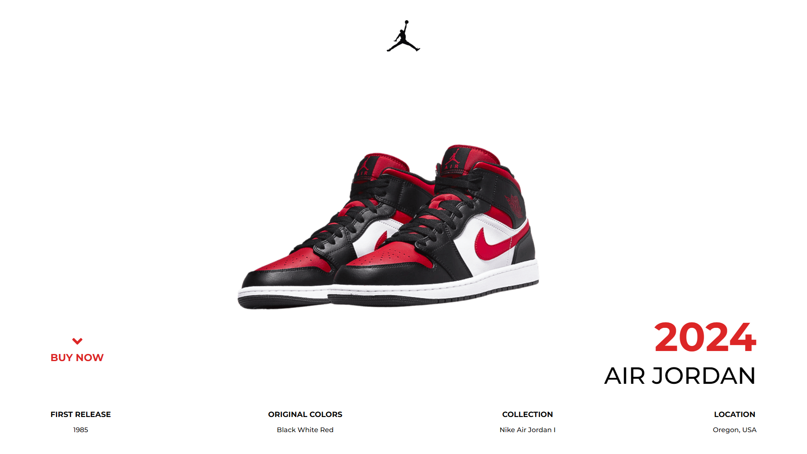

<div align="center">
  <h1>Nike Air Jordan</h1>
  
  
  
  
  
  
  <p>Página para promover o modelo Air Jordan da Nike.</p>
</div>

## Sumário

- [Sobre](#about)
- [Preview](#preview)
- [Tecnologias](#built-with)
- [Funcionalidades](#key-features)
- [Deploy](#deploy)
- [Destaques](#highlights)
- [Meu contato](#contact)

<h2 id="about">Sobre</h2>

Como um admirador dos modelos de sneakers da Nike, criei o UI Design e codei esse projeto. Hum... Tá bom, produção?

<h2 id="preview">Preview</h2>



<h2 id="built-with">Tecnologias</h2>

- HTML
- Sass
- Vite

<h2 id="key-features">Funcionalidades</h2>

- [x] Acessar modelos Jordan no site oficial da Nike

<h2 id="deploy">Deploy</h2>

[Nike Air Jordan](https://air-jordan-page.vercel.app/)

<h2 id="highlights">Destaques</h2>

Uso de variáveis e aninhamento em SCSS

```scss
.footer {
  margin: $margin-m $margin-l;

  .footer__items {
    display: flex;
    justify-content: space-between;

    .footer__item {
      gap: $gap-s;
      display: flex;
      align-items: center;
      flex-direction: column;

      .item__title {
        font-size: $font-size-s;
        font-weight: $font-weight-bold;
      }

      .item__text {
        font-weight: $font-weight-medium;
      }
    }
  }
}
```

<h2 id="contact">Meu contato</h2>

LinkedIn [@udanielnogueira](https://www.linkedin.com/in/udanielnogueira/)
